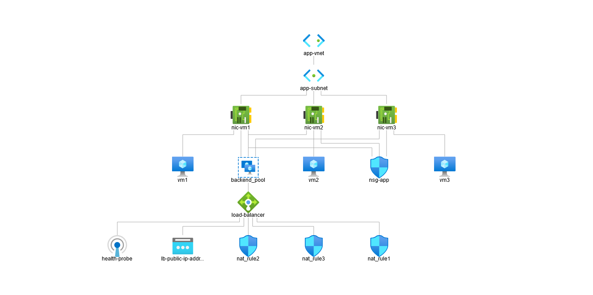
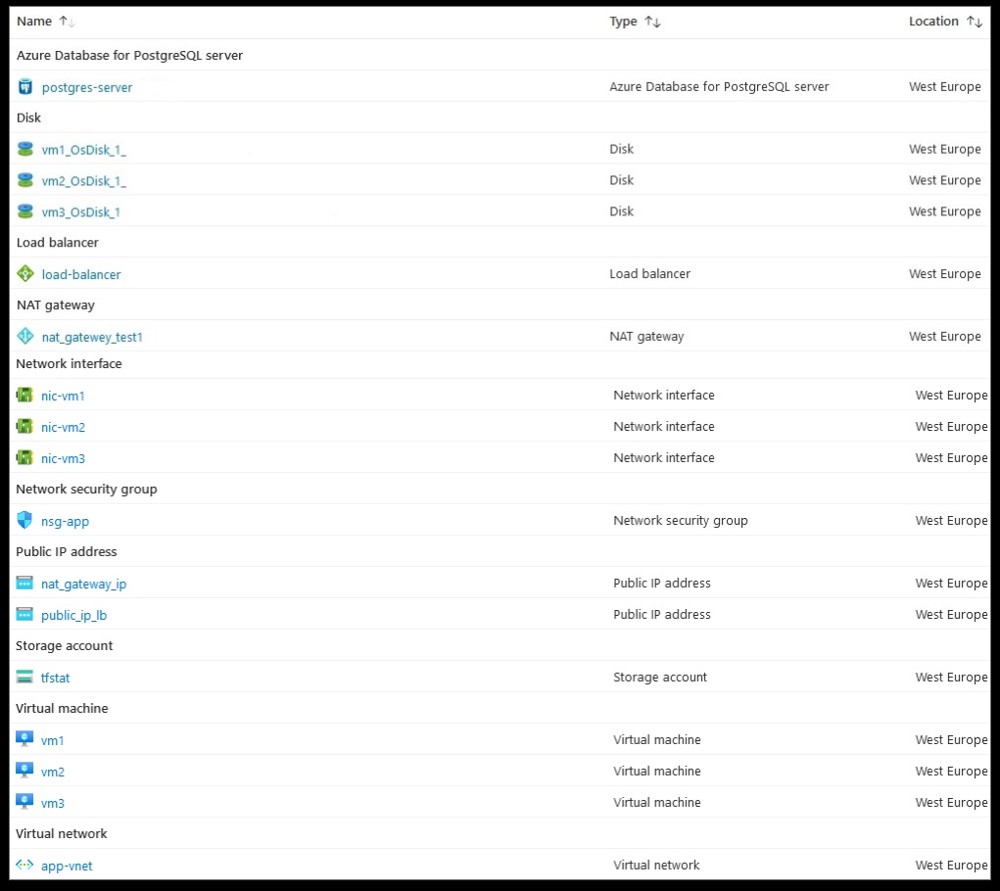

# bootcamp-terraform

### Automatic infrastructure with Terraform

### Topography


### Resources used


## How to use?

## 1- Install Terraform (https://learn.hashicorp.com/tutorials/terraform/install-cli?in=terraform/aws-get-started)

## 2- Create azure account
## 3- Install the Azure CLI and authenticate with Azure with the following command:
#     `az login`
## 4- Clone the project: (https://github.com/af009/terraform-project)
## 5- Create a file called terraform.tfvars in the root folder
```
admin_username = "your username"
admin_password = "your password"
PGUSERNAME     = "your postgres username"
PGDATABASE     = "your postgres db name"
PGPASSWORD     = "your postgres password"

```
## 6- Run the following commands:
```
// init
terraform init
// plan
terraform plan
// apply
terraform apply
```
## 7- Done!
